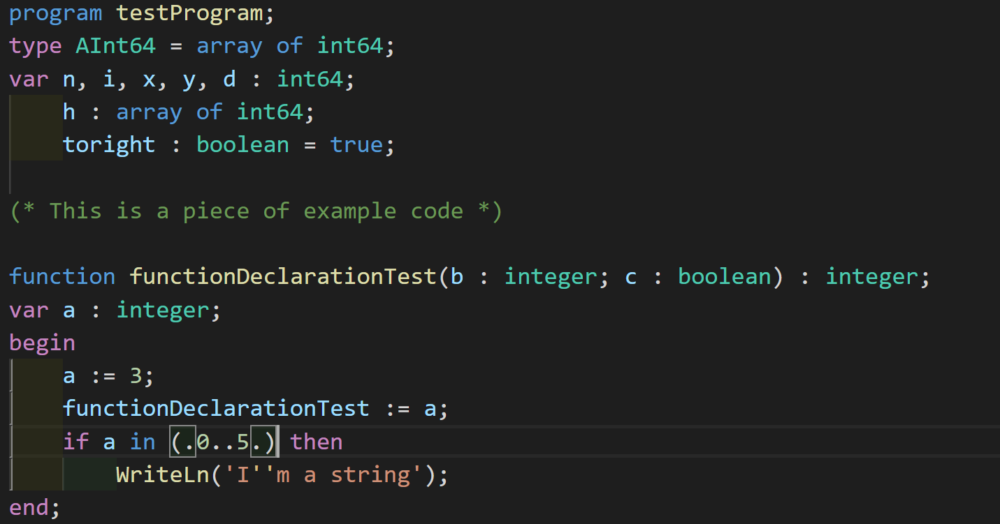

# Pascal Language Basics

This extension provides syntax highlighting for pascal code.

## Features

Provides syntax highlighting for Pascal code.

## Known Issues
* Some line breaks in code may break syntax highlighting due to the limitation of _TextMate_ used by _Visual Studio Code_. If you believe the correct formatting should be applied in your case, please file an issue at my repository.  

### [Release Notes](CHANGELOG.md)
